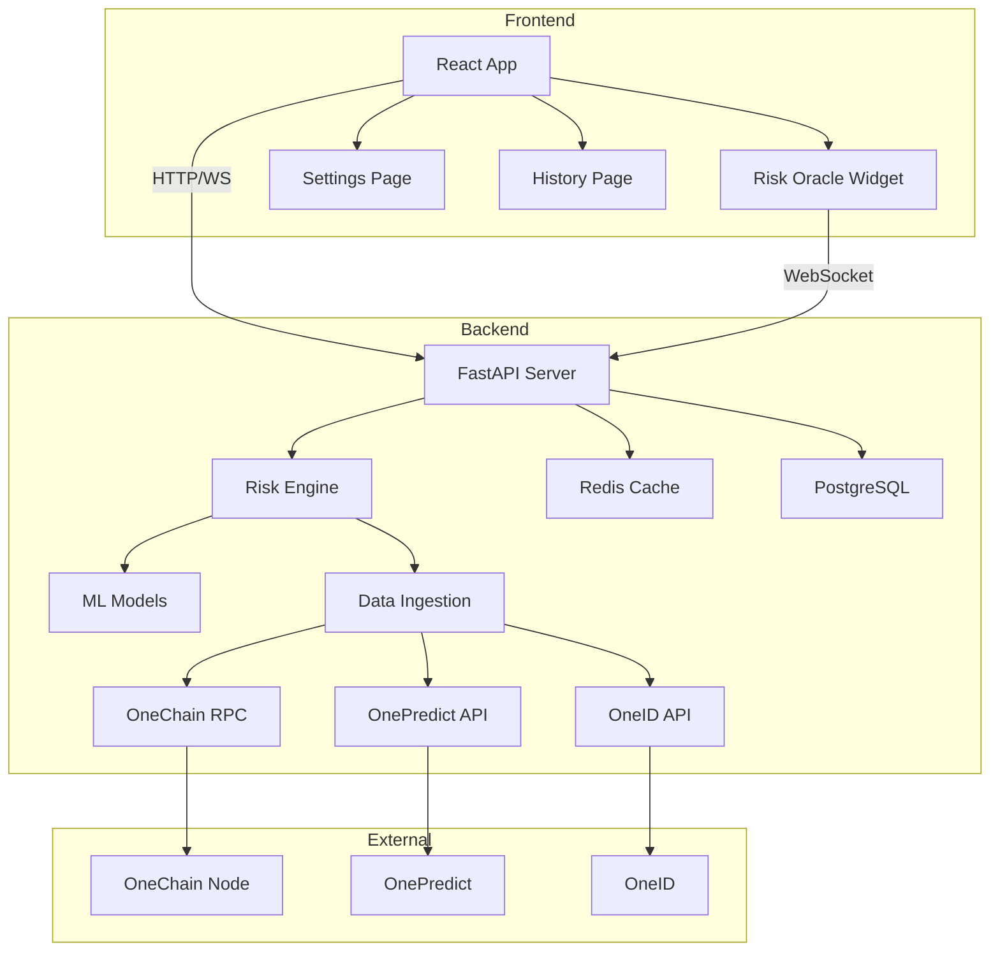
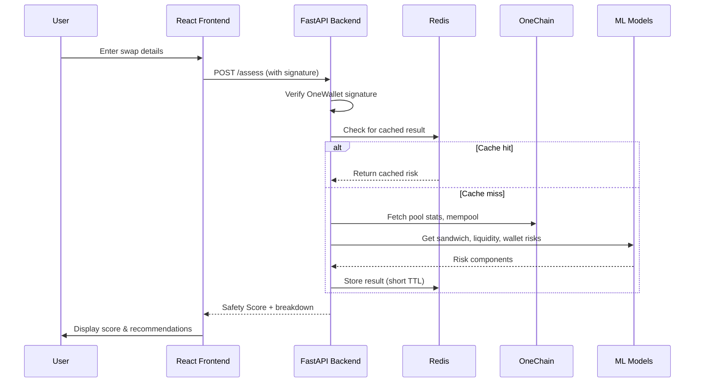

# The Risk Oracle

## AI-Powered Risk Assessment for OneDEX

[](LICENSE)
[](https://fastapi.tiangolo.com/)
[](https://reactjs.org/)
[](https://onechainlabs.io/)

**The Risk Oracle** is an AI-powered engine that protects traders on OneDEX by providing a **Safety Score** before every swap. It analyzes real‑time mempool activity, liquidity pool health, wallet reputation (via OneID), and volatility forecasts (via OnePredict) to detect sandwich attacks, rug pulls, and other threats. Built for **OneHack 3.0 – AI & GameFi Edition**, it demonstrates purposeful AI in DeFi.

---

## Table of Contents

- [Overview](#overview)
- [Features](#features)
- [Architecture](#architecture)
- [Tech Stack](#tech-stack)
- [Getting Started](#getting-started)
  - [Prerequisites](#prerequisites)
  - [Installation](#installation)
  - [Environment Variables](#environment-variables)
  - [Running with Docker](#running-with-docker)
- [API Documentation](#api-documentation)
- [Integration with OneChain Ecosystem](#integration-with-onechain-ecosystem)
- [AI Models](#ai-models)
- [Testing](#testing)
- [Deployment](#deployment)
- [Roadmap](#roadmap)
- [Contributing](#contributing)
- [License](#license)
- [Acknowledgments](#acknowledgments)

---

## Overview

In decentralized exchanges, retail traders often fall victim to **MEV attacks** (sandwiching, front‑running) and **liquidity manipulation** (rug pulls) because they lack real‑time, actionable risk information. The Risk Oracle fills this gap by combining on‑chain data with machine learning to deliver a **Safety Score** (0‑100) before a swap is confirmed.

The tool is deeply integrated with the OneChain ecosystem:
- **OneDEX** – swap data and liquidity pools
- **OnePredict** – volatility forecasts
- **OneID** – wallet reputation
- **OneWallet** – seamless authentication and UI embedding

---

## Features

- 🔍 **Sandwich Attack Detection** – XGBoost model trained on mempool and gas data.
- 💧 **Liquidity Health Forecast** – LSTM/regressor predicting pool stability.
- 🧾 **Wallet Reputation Scoring** – Autoencoder detecting anomalous behaviour via OneID.
- 🤖 **Personalized Safety Score** – Weighted combination of all risks.
- ⚙️ **Auto‑Protect Mode** – Automatically route high‑risk swaps through a private mempool (Flashbots).
- 📊 **Interactive Dashboard** – What‑if sliders, alternative suggestions.
- 🔔 **Real‑time Alerts** – WebSocket notifications for risk changes.
- 🗂️ **Swap History** – View past assessments and scores.
- 🌐 **Multi‑Page UI** – Settings, history, about pages.

---

## Architecture

### System Overview



### Data Flow for a Swap Assessment



### AI Model Pipeline

```mermaid
graph LR
    A[Raw Data] --> B[Feature Engineering]
    B --> C[Sandwich Detector (XGBoost)]
    B --> D[Liquidity Health (LSTM/Regressor)]
    B --> E[Wallet Risk (Autoencoder)]
    C --> F[Risk Aggregator]
    D --> F
    E --> F
    F --> G[Safety Score]
```

---

## Tech Stack

| Component       | Technology                                     |
|-----------------|------------------------------------------------|
| **Backend**     | Python 3.10+, FastAPI, SQLAlchemy, Celery      |
| **Frontend**    | React 18, TypeScript, Tailwind CSS, React Router |
| **AI/ML**       | scikit-learn, XGBoost, PyTorch (for LSTM)      |
| **Data Storage**| PostgreSQL, Redis (cache & broker)             |
| **Blockchain**  | Web3.py, OneChain RPC                          |
| **Infrastructure** | Docker, Docker Compose, Nginx                 |

---

## Getting Started

### Prerequisites

- Docker and Docker Compose (recommended)
- Python 3.10+ (if running locally)
- Node.js 18+ and npm (for frontend)

### Installation

1. **Clone the repository**

   ```bash
   git clone https://github.com/your-org/risk-oracle.git
   cd risk-oracle
   ```

2. **Set up environment variables**

   Copy `.env.example` to `.env` and fill in your API keys and RPC URLs.

3. **Run with Docker Compose**

   ```bash
   docker-compose up --build
   ```

   This starts:
   - FastAPI backend on `http://localhost:8000`
   - React frontend on `http://localhost:3000`
   - PostgreSQL on port 5432
   - Redis on port 6379
   - Celery worker

4. **Access the application**

   Open `http://localhost:3000` in your browser.

### Environment Variables

| Variable | Description |
|----------|-------------|
| `DATABASE_URL` | PostgreSQL connection string |
| `REDIS_URL` | Redis connection string |
| `ONE_CHAIN_RPC_URL` | OneChain RPC endpoint |
| `ONE_DEX_CONTRACT_ADDRESS` | OneDEX router address |
| `ONE_PREDICT_API_KEY` | API key for OnePredict |
| `ONE_ID_API_KEY` | API key for OneID |
| `SECRET_KEY` | JWT secret key |
| `SANDWICH_MODEL_PATH` | Path to trained XGBoost model |
| `LIQUIDITY_MODEL_PATH` | Path to LSTM/regressor model |
| `WALLET_MODEL_PATH` | Path to autoencoder model |

### Running Locally without Docker

#### Backend

```bash
cd backend
pip install -r requirements.txt
uvicorn app.main:app --reload
```

#### Frontend

```bash
cd frontend
npm install
npm start
```

---

## API Documentation

Once the backend is running, visit `http://localhost:8000/docs` for interactive Swagger UI.

### Endpoints

| Method | Endpoint | Description |
|--------|----------|-------------|
| POST | `/auth/login` | Authenticate with OneWallet signature |
| POST | `/assess` | Get risk score for a swap |
| POST | `/suggest` | Get alternative swap suggestions |
| GET | `/settings/{address}` | Fetch user settings |
| POST | `/settings/{address}` | Update user settings |
| GET | `/history/{address}` | List past assessments |
| GET | `/health` | Health check |

### Example Request

```json
POST /assess
{
  "user_address": "0x123...abc",
  "token_in": "ONE",
  "token_out": "USDC",
  "amount_in": 1000.0,
  "signature": "0x...",
  "nonce": "abc123"
}
```

### Example Response

```json
{
  "safety_score": 78,
  "risk_breakdown": {
    "sandwich_risk": 12,
    "liquidity_health": 92,
    "wallet_risk": 15
  },
  "explanation": "Sandwich risk is low. Pool is healthy with deep liquidity. Wallet reputation is good.",
  "recommendation": "✅ Low risk – safe to swap. Always double‑check the token address."
}
```

---

## Integration with OneChain Ecosystem

### OneDEX

- The Risk Oracle queries OneDEX smart contracts for pool reserves, liquidity, and swap parameters.
- The Safety Score is displayed directly inside OneWallet’s swap confirmation modal.

### OnePredict

- Volatility forecasts are fetched via OnePredict’s API and used to adjust risk weights.
- Higher volatility increases the overall risk score.

### OneID

- Wallet reputation (score 0‑100) is retrieved from OneID.
- The autoencoder model uses this reputation together with transaction history to detect anomalies.

### OneWallet

- Authentication is handled through signed messages (EIP‑712 style).
- The frontend integrates the Risk Oracle widget as a step before transaction submission.

---

## AI Models

### Sandwich Detection (XGBoost)

- **Features**: pending count for pair, gas price percentile, gas price std, time since last block, amount in USD, pool liquidity, volatility forecast.
- **Training**: Historical attacks labelled by replaying blocks and identifying profitable sandwich patterns.
- **Output**: Probability (0‑100) that the user’s swap will be sandwiched.

### Liquidity Health (LSTM/Regressor)

- **Features**: liquidity depth, 24h volume, LP holder concentration, volatility forecast, swap amount.
- **Training**: Time‑series of pool metrics; target is the pool’s stability (e.g., price impact resistance).
- **Output**: Health score (0‑100), higher means safer.

### Wallet Risk (Autoencoder)

- **Features**: wallet age, transaction count, average transaction value, number of unique tokens, OneID reputation.
- **Training**: Normal behaviour patterns; high reconstruction error indicates anomaly.
- **Output**: Risk score (0‑100) – higher means riskier.

The final **Safety Score** is a weighted average:

```
Safety Score = 100 - (0.4*sandwich + 0.3*(100-liquidity) + 0.2*wallet + 0.1*volatility)
```

---

## Testing

Run backend tests with `pytest`:

```bash
cd backend
pytest tests/
```

Frontend tests (using Jest):

```bash
cd frontend
npm test
```

---

## Deployment

The application is containerized and can be deployed to any cloud provider.

1. **Build images**

   ```bash
   docker-compose build
   ```

2. **Push to registry** (e.g., Docker Hub, AWS ECR)

3. **Deploy with orchestration** (Kubernetes, ECS, etc.) using the provided `docker-compose.yml` as a reference.

For production, ensure:
- Use a production‑grade PostgreSQL instance (not the default `postgres:14-alpine`).
- Set `SECRET_KEY` and API keys as secrets.
- Enable HTTPS via a reverse proxy (nginx) with Let’s Encrypt.

---

## Roadmap

- [x] Basic risk score MVP
- [x] AI models for sandwich, liquidity, wallet
- [x] Auto‑protect and Flashbots integration (simulated)
- [x] WebSocket real‑time updates
- [x] User settings and history pages
- [ ] Live deployment on OneChain testnet
- [ ] Integration with actual Flashbots relay
- [ ] Cross‑chain support for other DEXs
- [ ] Mobile app with push notifications

---

## Contributing

We welcome contributions! Please follow these steps:

1. Fork the repository.
2. Create a feature branch (`git checkout -b feature/amazing-feature`).
3. Commit your changes (`git commit -m 'Add some amazing feature'`).
4. Push to the branch (`git push origin feature/amazing-feature`).
5. Open a Pull Request.

---

## License

Distributed under the MIT License. See `LICENSE` for more information.

---

## Acknowledgments

- Built for **OneHack 3.0 – AI & GameFi Edition**
- Thanks to OneChain Labs for providing the infrastructure and APIs
- Inspired by the need to make DeFi safer for everyone

---

**Live Demo** (coming soon)  
**Contact**: [team@riskoracle.io](mailto:team@riskoracle.io)

---

*Made with ❤️ for the OneChain community*

